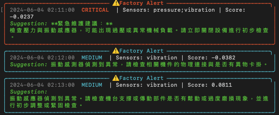

# 智慧工廠告警 Agent
A Smart Factory Anomaly Detection Agent with Dual-Track Detection and LLM-Powered Maintenance Suggestions

## 1. 專案簡介
本專案為「智慧工廠告警 Agent」，旨在模擬工業設備感測器資料，並透過「規則式 (Rule-based)」與「機器學習 (IsolationForest)」雙軌機制即時偵測設備異常。系統會針對偵測到的異常產生分級告警，並串接 LLM 提供維護建議。

## 2. 環境需求與安裝步驟
### 環境需求
- Python 3.10+
- Ollama (若需使用 LLM 功能)

### 安裝步驟
1. 安裝必要套件：
   ```bash
   pip install -r requirements.txt
   ```
2. 下載 LLM 模型 (Ollama)：
   ```bash
   ollama pull gemma4:e4b
   ```

## 3. 使用方式
本專案透過 `main.py` 提供命令列介面。

### 告警偵測模式 (預設)
執行資料生成 $\rightarrow$ 偵測 $\rightarrow$ 呼叫 LLM 產生建議 $\rightarrow$ 輸出告警。
```bash
python3 main.py
```
CLI結果


### 禁用 LLM 模式
不呼叫 Ollama，直接使用預設維護建議模板。
```bash
python3 main.py --no-llm
```
```text
╭────────────────────────────────────────────── ⚠️ Factory Alert ──────────────────────────────────────────────╮
│ 2024-06-04 03:14:00  MEDIUM  | Sensors: vibration | Score: 0.0730                                            │
│ Suggestion: 中度警告：ML 偵測到 vibration 異常模式。請密切監控是否存在漸進劣化 (drift)。 (Fallback Template) │
╰──────────────────────────────────────────────────────────────────────────────────────────────────────────────╯
╭────────────────────────────────────────────── ⚠️ Factory Alert ───────────────────────────────────────────────╮
│ 2024-06-04 03:15:00  CRITICAL  | Sensors: temp;pressure | Score: 0.0217                                       │
│ Suggestion: 嚴重警告：多個感測器 (temp;pressure) 數值極端。請立即緊急停機並進行人工檢查。 (Fallback Template) │
╰───────────────────────────────────────────────────────────────────────────────────────────────────────────────╯
```

### 模擬重播模式
調整告警輸出之間的間隔秒數（例如每筆間隔 0.5 秒）。
```bash
python3 main.py --replay-speed 0.5
```
```text
╭──────────────────────── ⚠️ Factory Alert ─────────────────────────╮
│ 2024-06-04 03:14:00  MEDIUM  | Sensors: vibration | Score: 0.0730 │
│ Suggestion: 請檢查振動傳感器連接或機械部件是否有輕微鬆動或異音。  │
╰───────────────────────────────────────────────────────────────────╯
----------------------------------------0.5s----------------------------------------
╭───────────────────────────────────────── ⚠️ Factory Alert ─────────────────────────────────────────╮
│ 2024-06-04 03:15:00  CRITICAL  | Sensors: temp;pressure | Score: 0.0217                            │
│ Suggestion: **立即檢查高溫和壓力異常。建議初步檢查冷卻系統及工件負載，判斷是否為過熱或超壓警報。** │
╰────────────────────────────────────────────────────────────────────────────────────────────────────╯
```

### 量化評估模式
執行偵測器性能評估，計算 Precision / Recall / F1 指標並產出混淆矩陣。
```bash
python3 main.py --evaluate
```
```text
--- Running Evaluation Mode ---

Detector Performance Metrics:
[RULE] Precision: 1.0000, Recall: 0.5000, F1: 0.6667
[ML] Precision: 0.4167, Recall: 0.8333, F1: 0.5556
[ENSEMBLE] Precision: 0.4167, Recall: 0.8333, F1: 0.5556

```
- **評估結果**：（執行 `python3 main.py --evaluate` 產生）
- **混淆矩陣路徑**：`docs/confusion_matrices.png`

## 4. 專案結構
| 模組/目錄 | 職責說明 |
| :--- | :--- |
| `main.py` | CLI 入口，處理參數解析與模式切換 |
| `agent.py` | 數據流水線 (Pipeline) 協調者 |
| `config.py` | 集中定義所有系統常數、閾值與路徑 |
| `preprocess.py` | 資料讀取、缺失值處理、時序切分與標準化 |
| `features.py` | 計算因果 rolling 特徵 (Mean, Std, Diff) |
| `rule_detector.py` | 依 config.THRESHOLDS 對原始感測器值做閾值判定，產生 rule_flag 與 rule_reason |
| `ml_detector.py` | 使用 IsolationForest 進行新奇偵測 (Novelty Detection) |
| `ensemble.py` | 合併雙軌結果，判定告警等級 (Critical/High/Medium) |
| `llm_advisor.py` | 串接 LLM 為異常事件生成維護建議 |
| `evaluate.py` | 量化評估偵測器的性能指標 |
| `output.py` | 告警格式化輸出與 `alerts.log` 寫入 |
| `generate_data.py` | 生成含常態分佈與多樣化異常事件的模擬資料 |
| `tests/` | 存放所有單元測試與集成測試 |

## 5. 資料格式
- **檔案路徑**：`data/raw_data.csv`
- **欄位定義**：

| 欄位 | 類型 | 說明 | 正常範圍 (參考 `config.py`) | 異常閾值 (觸發 Rule) |
| :--- | :--- | :--- | :--- | :--- |
| `timestamp` | string | 時間戳記 (`YYYY-MM-DD HH:MM:SS`) | - | - |
| `temp` | float | 溫度 (deg C) | 45.0 ~ 50.0 | >52 或 <43 |
| `pressure` | float | 壓力 (bar) | 1.00 ~ 1.05 | >1.08 或 <0.97 |
| `vibration` | float | 震動 (g) | 0.02 ~ 0.04 | >0.07 |
| `label` | string | 真實標籤 (`normal` / `abnormal`) | - | - |

- **範例列**：`2024-06-03 19:00:00, 47.5, 1.02, 0.03, normal`

## 6. 輸出檔案
- `data/raw_data.csv`：生成的模擬感測器原始數據集。
- `logs/alerts.log`：記錄所有偵測到的告警及其維護建議。
- `docs/confusion_matrices.png`：量化評估模式產出的偵測器混淆矩陣圖。

## 7. 執行測試
使用 `pytest` 驗證所有模組功能：
```bash
python3 -m pytest tests/ -v
```

## 8. 設計摘要
本系統採用雙軌偵測架構：規則軌捕捉極端值，ML 軌則透過 IsolationForest 捕捉複雜模式。模型僅在純正常資料集 (Block A) 上訓練，以實現新奇偵測。資料採取嚴格時序切分 (Train → Cal → Test)，確保校準與測試過程完全不接觸未來數據，防止資料洩漏。詳情請參閱技術報告。

## 9. AI 工具使用
本專案採用 **AI-Augmented Engineering** 工作流，將多個 LLM 模型分工協作：
- **方案設計**：由 Claude Sonnet 5 (claude.ai 免費版) 進行核心 Brainstorming 與技術諮詢。
- **規格審計**：利用 Gemini 執行「批判模式審計 (Cross-Audit)」找出規格文件中的邏輯矛盾。
- **自動化開發**：透過 Claude Code 搭配 Ollama (gemma4:31b-cloud) 實作 TDD 流水線並執行自我 Code Review。
- **架構驗證**：利用 Claude Code 搭配 Ollama (nemotron-3-super:cloud) 執行 Code Review 找出 Codebase 的邏輯矛盾並再以人工審核。
- **驗證反饋**：透過 AI 審計 $\rightarrow$ 人工驗證 $\rightarrow$ 迭代修正的循環，確保系統魯棒性。
